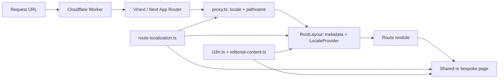

# Mapa do codebase

Este documento mostra onde uma mudança deve começar e quais arquivos precisam
permanecer sincronizados. O código é a fonte de verdade para listas de rotas e
conteúdo.

## Visão geral



O site é server-rendered pelo Worker. Componentes interativos recebem o locale
calculado no servidor por meio de `LocaleProvider`; a URL, e não estado salvo no
navegador, determina o idioma.

## Mapa de diretórios

| Caminho | Responsabilidade |
| --- | --- |
| [`app/`](../app/) | App Router, layout, páginas, conteúdo, localização e CSS global |
| [`app/components/`](../app/components/) | Navegação, rodapé e renderizadores reutilizáveis |
| [`public/`](../public/) | Marcas, fotos, stills e imagem social |
| [`tests/`](../tests/) | Testes de integração do HTML renderizado pelo Worker |
| [`worker/`](../worker/) | Entrada Cloudflare e otimização de imagens |
| [`build/`](../build/) | Empacotamento dos metadados do Sites e migrations |
| [`.openai/`](../.openai/) | Identidade e bindings do projeto hospedado |
| [`db/`](../db/), [`drizzle/`](../drizzle/) | Scaffold opcional de D1; atualmente sem schema ativo |

Arquivos gerados (`dist/`, `.next/`, `.vinext/`, `.wrangler/` e
`*.tsbuildinfo`) não devem ser editados nem commitados.

[`app/chatgpt-auth.ts`](../app/chatgpt-auth.ts) e `examples/d1/` também vieram
do starter e não são importados pelas rotas públicas atuais.

Não use `db/index.ts` antes de configurar o binding D1 em
`.openai/hosting.json`, criar o schema e provisionar o binding no deploy. O
helper falha explicitamente quando `env.DB` não existe.

## Rotas e idioma

[`app/route-localization.ts`](../app/route-localization.ts) é a fonte única das
URLs equivalentes. As famílias públicas são:

| Área | Português | English |
| --- | --- | --- |
| Home e grupo | `/`, `/grupo` | `/en`, `/en/collective` |
| Espetáculos | `/espetaculos/*` | `/en/performances/*` |
| Audiovisual | `/audiovisual/*` | `/en/screen/*` |
| Formação | `/atividades-formativas/*` | `/en/learning/*` |
| Debates | `/debates-mediados/*` | `/en/conversations/*` |
| Agenda e histórico | `/agenda`, `/historico` | `/en/agenda`, `/en/history` |

Aliases preservados: `/cenicas`, `/formacao` e `/menino-assum-preto`. Eles têm
módulos físicos que reutilizam as páginas canônicas.

Fluxo de localização:

1. [`proxy.ts`](../proxy.ts) grava `x-flying-low-locale` e
   `x-flying-low-pathname` a partir da URL.
2. [`app/layout.tsx`](../app/layout.tsx) usa esses headers no `<html lang>`, nos
   metadados e no `LocaleProvider`.
3. Navegação e seletor de idioma usam chaves de rota, nunca troca manual de
   prefixos.
4. Módulos em `app/en/` normalmente reutilizam a implementação portuguesa; o
   provider seleciona o conteúdo inglês durante a renderização.

Para metadata e troca de idioma, uma URL sem chave reconhecida usa a home como
fallback. Isso não redireciona a requisição: o App Router ainda pode responder
404.

## Conteúdo e composição

Há duas fontes de texto:

- [`app/i18n.ts`](../app/i18n.ts): navegação, rodapé, home e strings gerais de
  interface. Português define o formato e inglês implementa a mesma tipagem.
- [`app/editorial-content.ts`](../app/editorial-content.ts): coleções, projetos,
  agenda, histórico, integrantes, créditos, links e referências de mídia em PT
  e EN.

Páginas de rota devem ser finas:

- `CollectionPage` renderiza Audiovisual, Formação e Debates.
- `ProjectPage` renderiza detalhes de espetáculos, filmes, atividades e debates.
- `PerformancesPage` mantém a composição própria da página de Espetáculos.
- Home, Grupo, Agenda e Histórico têm composições específicas em seus módulos.

[`app/image-dimensions.ts`](../app/image-dimensions.ts) registra o tamanho de
cada imagem editorial local. Ao adicionar um asset em `public/`, adicione também
sua dimensão para evitar mudança de layout durante o carregamento.

## Metadados e conteúdo oculto

[`app/layout.tsx`](../app/layout.tsx) deriva título e descrição da rota ativa e
gera canonical, hreflang, Open Graph e Twitter. Ao adicionar uma rota editorial,
ela também deve ser associada ao projeto ou à coleção nesse arquivo.

Estados intencionais atuais:

- Histórico e Cantigas continuam acessíveis, mas recebem `noindex, nofollow`.
- Histórico não aparece na navegação principal.
- Perfis individuais dos integrantes permanecem nos dados, mas não renderizam
  enquanto `membersVisible` estiver `false` nos dois idiomas.
- Conteúdo incompleto deve exibir `Em atualização` / `Being updated`; não use
  esse estado para substituir informação já confirmada.

## Receitas de mudança

| Objetivo | Arquivos mínimos | Conferência principal |
| --- | --- | --- |
| Corrigir texto editorial | `editorial-content.ts` em PT e EN | Rota equivalente nos dois idiomas |
| Corrigir texto de interface | `i18n.ts` em PT e EN | Home, menu ou componente afetado |
| Adicionar projeto | `editorial-content.ts`, rota PT, rota EN, `route-localization.ts`, `layout.tsx` | Link interno, metadata, página PT/EN |
| Adicionar imagem | `public/`, `image-dimensions.ts`, conteúdo editorial | Alt text, proporção e carregamento |
| Alterar navegação | `SiteNav.tsx`, `SiteFooter.tsx`, `route-localization.ts` | Desktop, menu mobile e seletor PT/EN |
| Alterar indexação | `layout.tsx` | Robots, canonical e hreflang renderizados |

## Validação e deploy

```bash
npm run lint
npx tsc --noEmit
npm test
```

O teste importa `dist/server/index.js`, por isso `node --test` isolado não basta:
`npm test` sempre gera o build primeiro. A suíte cobre SSR, idioma, rotas,
metadata, conteúdo e proteções de acessibilidade por asserções no HTML/CSS.

Não há suíte E2E configurada. Mudanças de layout, menu, hover, vídeo ou
responsividade exigem inspeção no navegador em PT e EN. O deploy usa Vinext,
Vite e Cloudflare Workers; `build/sites-vite-plugin.ts` copia a configuração do
Sites e eventuais migrations para `dist/.openai`. Não há script de publicação:
o repositório produz o artefato `dist/`, e o control plane de hospedagem faz o
deploy.
